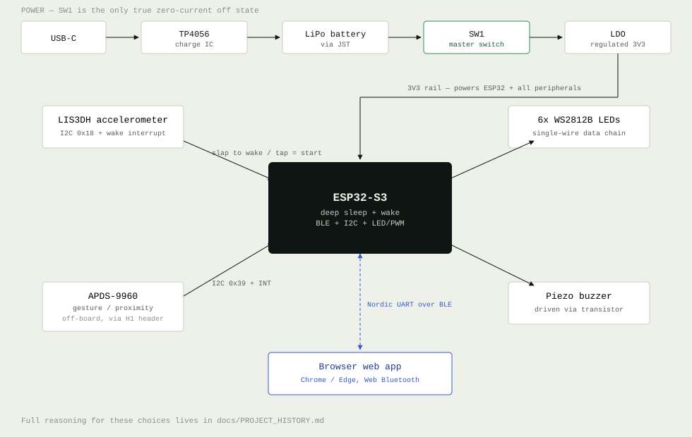

# Smart Puck


An ESP32-S3-based smart hockey puck: accelerometer-triggered wake/gameplay,
addressable LEDs, buzzer feedback, and BLE control from a companion web app —
no native app install required.

## Features

- **Slap-to-wake** — an accelerometer tap/click wakes the puck from deep sleep
  and doubles as the "press-to-start" gameplay gesture.
- **Gesture & proximity sensing** — an APDS-9960 sensor detects hand passes
  near the puck for touch-free interaction.
- **6x addressable RGB LEDs** — full-color feedback, controllable per-LED or
  all at once.
- **Piezo buzzer** — audible feedback for events and gameplay cues.
- **Browser-based control** — connects over Web Bluetooth directly from
  Chrome or Edge (desktop or Android), with a live 3D orientation view and
  gesture visualizer. See it in [`code/web-app/`](code/web-app/).

## How it works



- **Power.** USB-C charges a LiPo battery through a TP4056 charge IC; an LDO
  regulates that down to a steady 3V3 rail for the ESP32-S3 and everything
  else on the board.
- **Wake & gameplay input.** The LIS3DH accelerometer's tap/click interrupt
  wakes the ESP32-S3 from deep sleep in milliseconds — the same slap that
  wakes the puck also starts a round, so there's no separate power-on step
  before play.
- **Sensing.** Once awake, the firmware reads the accelerometer over I2C for
  orientation/motion, and an APDS-9960 sensor (wired in through the `H1`
  header) for proximity and gesture detection near the puck's face.
- **Feedback.** Six WS2812B addressable LEDs (daisy-chained on a single data
  line) and a piezo buzzer (driven through a transistor, not directly from a
  GPIO) give visual and audible feedback for gameplay events.
- **Control.** The ESP32-S3 exposes a Nordic UART-style BLE service. The
  browser control page ([`code/web-app/`](code/web-app/)) connects to it
  directly over Web Bluetooth — no native app, no pairing flow — to send
  commands and stream live sensor data back for the on-page 3D orientation
  and gesture views.

The full reasoning behind these choices — why a hardware switch instead of a
soft-power circuit, which GPIOs are wake-capable, how BOM issues were caught —
is in [`docs/PROJECT_HISTORY.md`](docs/PROJECT_HISTORY.md).

## Repo structure

```
code/
├── firmware/     # PlatformIO project (ESP32-S3 Arduino firmware)
└── web-app/      # Browser-based BLE control page

hardware/         # Schematic, PCB, and BOM (EasyEDA exports)
├── schematic/    # Schematic PDF exports
├── pcb/          # PCB layout export
└── bom/          # Bill of materials (BOM.csv)

docs/
├── PROJECT_HISTORY.md   # Design decisions, pin/power architecture, BOM fixes
└── images/              # Rendered schematic/PCB views + architecture diagram
```

Start with [`docs/PROJECT_HISTORY.md`](docs/PROJECT_HISTORY.md) for the "why"
behind the design, and each subfolder's own README for the "how" of working
with that piece:

- [`code/firmware/README.md`](code/firmware/README.md) — build/flash the
  ESP32-S3 firmware
- [`code/web-app/README.md`](code/web-app/README.md) — run the BLE control
  page
- [`hardware/README.md`](hardware/README.md) — schematic, PCB, and BOM status

## Key components

| Part | Role |
|---|---|
| ESP32-S3-WROOM-1-N16R8 | MCU |
| LIS3DHTR | Accelerometer (wake/tap detection) |
| APDS-9960 | Gesture / proximity sensor (off-board, via `H1` header) |
| WS2812B x6 | Addressable RGB LEDs |
| TS-1187A x3 | Tactile buttons — wake, BOOT, EN/reset |
| TP4056 + LDO | USB-C charge management + 3V3 regulation |
| LiPo + JST | Battery power |

Full part list with manufacturer/supplier part numbers: [`hardware/bom/BOM.csv`](hardware/bom/BOM.csv).

## Hardware

| Schematic | PCB layout |
|---|---|
| [](hardware/schematic/SCH_Schematic1_2026-09-05.pdf) | [](hardware/pcb/PCB_PCB1_2026-09-05.pdf) |

Click either image for the full-resolution PDF export. See
[`hardware/README.md`](hardware/README.md) for the folder layout and an open
item worth double-checking (a master power switch described in the design
history doesn't appear in this board's BOM).
