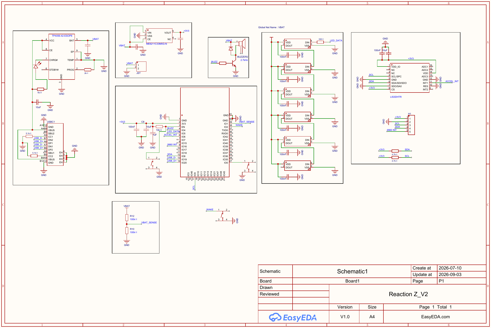
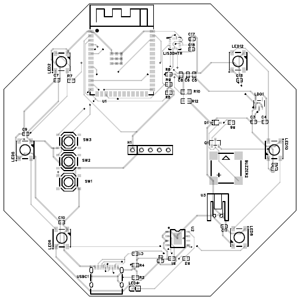

# Hardware

This folder holds the electrical design files for the Smart Puck: schematic,
PCB layout, and bill of materials.

The board was designed in EasyEDA.

```
hardware/
├── schematic/
│   ├── SCH_Schematic1_2026-09-05.pdf   # Main schematic
│   └── SCH_Schematic2_2026-09-05.pdf   # Secondary sheet (blank in this rev)
├── pcb/
│   └── PCB_PCB1_2026-09-05.pdf         # PCB layout + assembly + BOM export
├── bom/
│   └── BOM.csv                         # Bill of materials, extracted from the PCB export
└── README.md
```





**Status:** schematic, PCB layout, and BOM are all in place. Gerbers/drill
files for fab are still pending. See `docs/PROJECT_HISTORY.md` for the pin
assignments, part choices, and BOM fixes worked out during schematic/PCB
review.

Key parts, cross-checked against `bom/BOM.csv`:
- MCU: ESP32-S3-WROOM-1-N16R8
- Accelerometer: LIS3DHTR (I2C, `0x18`)
- Gesture/proximity: APDS-9960 (I2C, `0x39`) — **off-board**, wired in through
  the 5-pin `H1` header (`SDA`/`SCL`/`+3V3`/`GND`/`9960 INT`); it isn't a
  populated part on this PCB
- LEDs: 6x WS2812B (`LED2,5,6,8,10,12`) + 1x status LED (`LED4`)
- Buttons: 3x TS-1187A tactile switches (`SW1,SW2,SW3`) — wake (`IO2`), BOOT
  (`IO0`), and EN/reset
- Battery: LiPo via JST (`S2B-PH-K-S`), USB-C input, TP4056 charge IC, LDO for 3V3

**Open item:** `docs/PROJECT_HISTORY.md` describes a hardware slide switch
(e.g. MSK-12C02) in series between `B+` and `VBAT` as the intended
zero-current master power cutoff. No such part appears in this board's BOM or
schematic — worth confirming whether it was deferred, or lives on a separate
harness not captured in this export.
